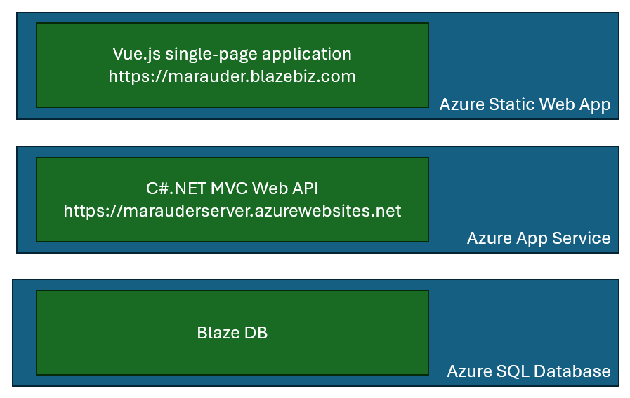
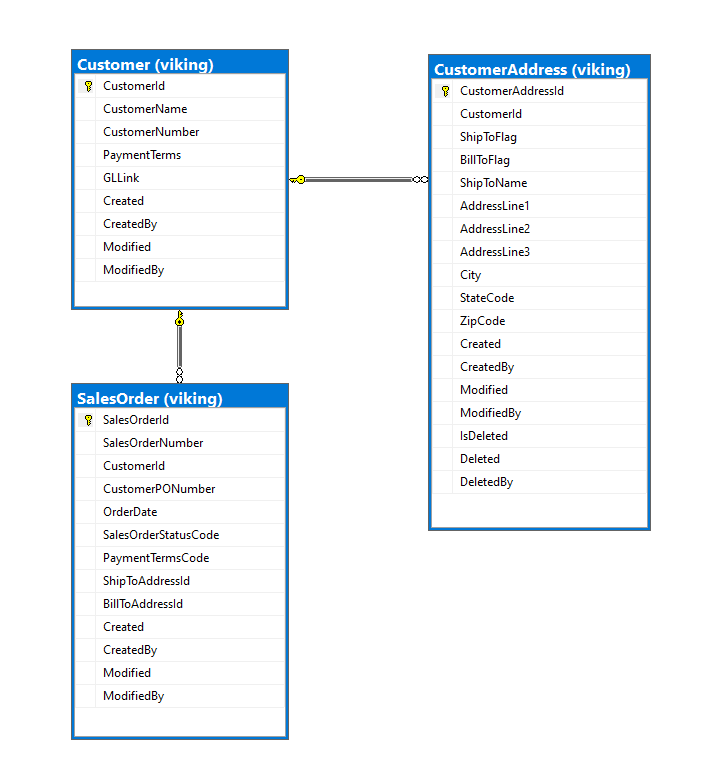

# Iron Marauder

_Iron Marauder_ is an application created to demonstrate architecture and coding concepts. It allows the user to search, edit, and create Customers and Sales Orders.

The Iron Marauder application is purely for demonstration. The app isn't complete enough to allow you to accomplish anything meaningful. The database is a tiny subset of an actual ERP application. The database and user interface were chosen to be enough to demonstrate meaningful concepts, without being overly complex, thus detracting from its usefulness for education.

## Running Marauder

To launch Marauder, go to [https://marauder.blazebiz.com/](https://marauder.blazebiz.com/).

> **Note on delayed startup**: This application uses the _Azure SQL Serverless_ Free tier. One of the features of this, which can't be disabled, is the auto-pause feature. If there is no activity against the database for an hour, Azure SQL pauses the database. The first time the application tries to open a connection after this, Azure SQL must resume the database. This can take up to a minute, so it typically results in a connection timeout error. The API has retry logic to recover from the timeout and connect, but you'll notice a long delay the first time the application hits the database after a time of inactivity.

## Overall Architecture

Marauder is a full-stack application that contains these components in its stack:

- A _Vue.js 3.0 / JavaScript_ application front-end to present the user interface.
  - A single-page application (SPA) - uses Vue Router to switch the user between logical pages within the single frame.
  - This is hosted as an _Azure Static Web App_.
- A _.NET 6.0 Web API_ written in _C#_.
  - Data layer to execute stored procedures and rehydrate objects (including full graphs where appropriate)._Does not_ use Entity Framework or any other ORM.
  - Much of the data layer and model layer is generated based on the database schema.
  - This is hosted in the cloud as an_Azure App Service\_.
- An _Azure SQL_ database that stores all the application data
  - Also has stored procedures for efficient data access, returning an object and all it relations in one round-trip.

When you launch Marauder, the Vue application runs immediately and presents the Home page. Because of the database auto-pause (see Note above), the Home page makes a call to the API to get database statistics (row counts of Customers and Sales Orders). This was done simply to "wake-up" the database, since as a sample application, it doesn't get continuous use.

A data-driven navigation panel along the left side presents the user with options to search customers, add a customer, search sales orders, or add a sales order, along with Home and About selections. Each of these choices simply forwards a request to Vue Router to change the logical page.

## Architecture components

This section describes the main components of the architecture in more detail.

### Database

For illustration purposes, the database schema is simple:

#### Customer

The _Customer_ table has primary key _CustomerId_ and a few attributes.

#### CustomerAddress

_CustomerAddressId_ is the primary key, and there's a foreign key _CustomerId_ to relate any address to a single _Customer_. A customer may have many associated addresses.

#### SalesOrder

The _SalesOrder_ table has primary key, and foreign key _CustomerId_ to relate every order to a single customer. A customer may have many associated sales orders. There are foreign keys to the _CustomerAddress_ table in columns _ShipToAddressId_ and _BillToAddressId_.

Every table contains columns _Created_, _CreatedBy_, _Modified_, and _ModifiedBy_ to track who added or modified the row. Since there's no authentication in the application yet, the user id fields just get a placeholder id of 1.

_Customer_ and _SalesOrder_ can't be deleted, but _CustomerAddress_ can. The application uses a "soft delete", so as not to break any foreign key references from _SalesOrder_. Therefre, this table has _IsDeleted_ (a bit),  *Deleted* (a date-time), and _DeletedBy_.

### API server

_MarauderServer_ is a REST API server that responds to requests to read, add, or update application data. It conforms to a .NET 6.0 MVC (model-view-controller) architecture. Notable top-level folders / namespaces in the project are:

- `Controllers` (namespace `MarauderServer.Controllers`) - In an MVC API project, controllers define the REST endpoints. In other words, the methods inside these controllers are called directly by the MVC framework to execute based on HTTP requests. The two main controllers are:
  - `API_CustomersController` - responds to requests at URLs starting with `/api/customers/`.
  - `API_SalesOrdersController` - responds to requests at URLs starting with `/api/salesorders/`.
  - There's also a `API_StatisticsController` the has a single HTTP GET endpoint for getting database statistics (row counts). It's used by the client's Home page to simply "wake up" the databse.
- `Services` - In an MVC application of any complexity, it's useful to have a "service" layer that performs functions suc as validating data, combining multiple data requests together to respond to a single HTTP request,and other such application logic. Controllers shouldn't contain application logic, and Data services have the single responsibilty of database access, so this service layer is often useful. Because MarauderServer is pretty simple, this service layer currently isn't much more than a pass-through layer.
- `Data` - Data Access Objects (DAOs) reside in the `MarauderServer.Data` namespace. Specific DAOs generally align with database tables. The classes that correspond to Marauder tables are `CustomerData`, `CustomerAddressData`, and `SalesOrderData`.
  - The `base` subfolder contains these classes generated using a proprietary code generator, which reads the database schema and creates code for the DAO as a `partial class`. The programmer adds any customizations to the class in `partial class` files in the `Data` folder. For example, the method `ListCustomers` can be found in the `CustomerData` partial class in the `Data` folder.
  - In this manner, if the database schema changes, the code in the `base` folder may be regenerated, and the customized code won't be disturbed.
- `Models` - Model classes represent entities in the program, and typically match the database entities (tables). These too are generated from the database schema with a code generator, and use the same `partial class` and `base` folder technique as described under Data.

### Client

The Marauder client is a  web application built on `Vue.js`. It's a single-page application (SPA) that uses Vue Router to switch the user from view to view. It contains a left-side navigation panel that allows the user to search customers and orders, create new customers and orders, or edit existing customer and orders.

The Marauder client uses the Axios library to issue requests to the

## Source Code

<table><tbody><tr><td>Client</td><td>prototype/Vue/marauder-vue</td><td>A Vue 3.0 project. Open this folder in VSCode with appropriate extensions installed.</td></tr><tr><td>API Server</td><td>prototype/MarauderServer/MarauderServer.sln</td><td>A VS 2022 solution. It contains a Web API project and a Database project.</td></tr><tr><td>Database</td><td>prototype/VikingDB/VikingDB.sqlproj</td><td>Azure SQL schema and stored procedures.</td></tr></tbody></table>

## Hosting and deployment

### Database

### API server

### Client

## Notable features

### Database

- database project
- deployment scripts and environment variables
- test and production data
- Stored procedures
  - Complex parameters JSON
  - Complex result sets
- Publish profiles (test and production)

### API server

- Code generation
  - Partial classes, base folder, and custom properties and methods
  - Stored proc execution
  - Custom properties (e.g., Customer vs. CustomerId)
  - Related data properties (Customer.CustomerAddresses)
- Dependency injection - multiple levels
- Controllers
- Services
- Model
- Data
- Publish profile (Azure)

### Client

- Routing
  - Push, replace, parameters,
  - Route styling (exact match)
  - Page title
- Configurable navigation panel
- CSS Grid tables

## Future work (TODO)

- TODO: Database lookup tables for payment terms, order status, maybe state codes.
- TODO: State and local storage
  - Maybe for caching lookup tables
- TODO: Responsive design
- TODO: Color schemes
- TODO: Authentication -- add MS Identity Services, Azure AD B2C
- TODO:Role-based navigation and routing (after authentication exists)
