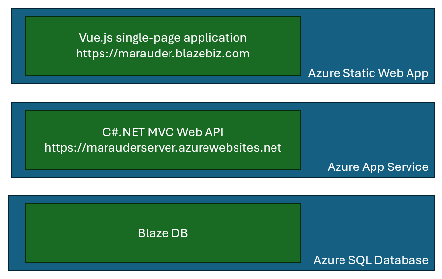

# Iron Marauder

_Iron Marauder_ is an application created to demonstrate architecture and coding concepts. It allows the user to search, edit, and create Customers and Sales Orders.

The Iron Marauder application is purely for demonstration. The app isn't complete enough to allow you to accomplish anything meaningful. The database is a tiny subset of an actual ERP application. The database and user interface were chosen to be enough to demonstrate meaningful concepts, without being overly complex, thus detracting from its usefulness for education.

## Running Marauder

To launch Marauder, go to [https://marauder.blazebiz.com/](https://marauder.blazebiz.com/).

> **Note on delayed startup**: This application uses the _Azure SQL Serverless_ Free tier. One of the features of this, which can't be disabled, is the auto-pause feature. If there is no activity against the database for an hour, Azure SQL pauses the database. The first time the application tries to open a connection after this, Azure SQL must resume the database. This can take up to a minute, so it typically results in a connection timeout error. The API has retry logic to recover from the timeout and connect, but you'll notice a long delay the first time the application hits the database after a time of inactivity.

## Overall Architecture

Marauder is a full-stack application that contains these components in its stack:

* A_Vue.js 3.0 / JavaScript_ application front-end to present the user interface.
  * A single-page application (SPA) - uses Vue Router to switch the user between logical pages within the single frame.
  * This is hosted as an_Azure Static Web App_.
* A_.NET 6.0 Web API_ written in_C#_.
  * Data layer to execute stored procedures and rehydrate objects (including full graphs where appropriate)._Does not_ use Entity Framework or any other ORM.
  * Much of the data layer and model layer is generated based on the database schema.
  * This is hosted in the cloud as an_Azure App Service_.
* An_Azure SQL_ database that stores all the application data
  * Also has stored procedures for efficient data access, returning an object and all it relations in one round-trip.

When you launch Marauder, the Vue application runs immediately and presents the Home page. Because of the database auto-pause (see Note above), the Home page makes a call to the API to get database statistics (row counts of Customers and Sales Orders). This was done simply to "wake-up" the database, since as a sample application, it doesn't get continuous use.

A data-driven navigation panel along the left side presents the user with options to search customers, add a customer, search sales orders, or add a sales order, along with Home and About selections. Each of these choices simply forwards a request to Vue Router to change the logical page.

This document contains information about the application architecture, its Azure hosting environment, and specific coding techniques that may interest a developer.

* Architecture
  * Database
  * API server
  * Client
* Hosting setup
  * Database
  * API server
  * Client
* Interesting features
  * Database
    - database project
    - deployment scripts and environment variables
    - test and production data
    - Stored procedures
      - Complex parameters JSON
      - Complex result sets
    - Publish profiles (test and production)
  * API server
    - Code generation
      - Partial classes, base folder, and custom properties and methods
      - Stored proc execution
      - Custom properties (e.g., Customer vs. CustomerId)
    - Dependency injection - multiple levels
    - Controllers
    - Services
    - Models
    - Data
    - Publish profile (Azure)
  * Client
    - Routing
      - Push, replace, parameters,
      - Route styling (exact match)
      - Page title
    - Configurable navigation panel
    - TODO: State and local storage
      - Maybe lookup tables, like State, Payment Terms
    - TODO: Responsive design
